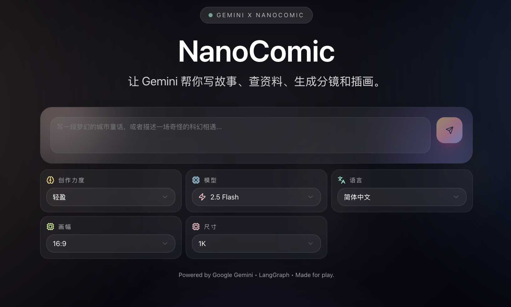
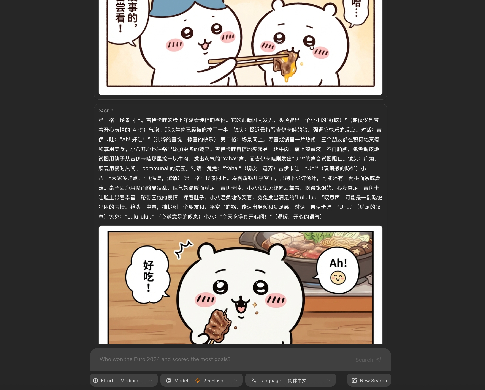

# NanoComic 漫画分镜生成器 / storyboard generator

一个面向漫画创作的分镜生成项目：自动调研并输出逐格脚本。  
Storyboarding for comics: auto research and frame-by-frame scripts.


## 功能概览 / Feature highlights
- 多步研究：生成查询 → 并行搜索 → 反思补充 → 分镜 JSON。  
  Multi-step research: queries → parallel search → reflection → JSON storyboard.

- 分镜预览：前端逐页渲染，并为每页触发图生成（需模型权限）。  
  Page cards on frontend; each card triggers image gen (requires model access).

- 模型可切换：Gemini 2.5 Flash / Flash Lite / 3 Pro Preview；语言可选（默认中文）。  
  Models: Gemini 2.5 Flash/Flash Lite/3 Pro Preview; language selectable (CN default).

- 一键开发启动：`make dev`。  
  One-command dev start: `make dev`.



## 目录结构 / Project layout
- `backend/`：LangGraph + FastAPI，含 `/generate_image`。  
  `backend/`: LangGraph + FastAPI with `/generate_image`.

- `frontend/`：Vite + React，展示对话/分镜卡片/图片状态。  
  `frontend/`: Vite + React UI for chat, cards, image status.

- `backend/scripts/test_generate_image.py`：独立图生成测试脚本。  
  `backend/scripts/test_generate_image.py`: standalone image test script.

## 环境与依赖 / Requirements
- Python 3.11+（后端）、Node 18+（前端）。  
  Python 3.11+ (backend), Node 18+ (frontend).

- 环境变量：`GEMINI_API_KEY`。  
  Env var: `GEMINI_API_KEY`.

- 图生成需 `gemini-3-pro-image-preview` 权限，否则无图/404。  
  Image gen needs access to `gemini-3-pro-image-preview`, else 404/no image.

## 快速开始 / Quick start
1) 克隆并进入项目，准备虚拟环境：  
   Clone repo and prepare venv:
   ```bash
   cd backend
   python -m venv .venv && source .venv/bin/activate
   pip install -e .
   echo "GEMINI_API_KEY=你的密钥" > .env
   ```

2) 前端安装依赖：  
   Install frontend deps:
   ```bash
   cd ../frontend
   npm install
   ```
3) 启动开发环境（根目录）：  
   Start dev (root):
   ```bash
   make dev   # 并行起前后端：Vite + langgraph dev
   ```
   前端默认 http://localhost:5173，LangGraph/后端默认 http://localhost:2024。  
   Frontend at http://localhost:5173, backend at http://localhost:2024.

## 常用命令 / Useful commands
- 后端单独开发：`cd backend && source .venv/bin/activate && langgraph dev`  
  Backend only: `cd backend && source .venv/bin/activate && langgraph dev`

- 前端单独开发：`cd frontend && npm run dev`  
  Frontend only: `cd frontend && npm run dev`

- 前端交互生成：页面输入主题 → 分镜逐页渲染 → 每页自动触发图生成（需模型权限）。  
  Frontend flow: enter topic → cards render → each card triggers image gen (model access required).

- 脚本验证图生成：  
  Scripted image test:
  ```bash
  cd backend && source .venv/bin/activate
  python scripts/test_generate_image.py --prompt "Robot holding a red skateboard"
  ```

## 已知注意事项 / Notes
- 图生成依赖 `gemini-3-pro-image-preview`，未开通会 404/无图；先用脚本验证。  
  Image gen needs `gemini-3-pro-image-preview`; without access expect 404/no image—verify via script.

- 分镜 prompt 过长或含链接时可能被过滤，可简化后再触发生成。  
  Long prompts/links may be filtered; simplify and retry if images are missing.
  
- 确保 `.env` 被加载（`langgraph dev` 默认读取 `backend/.env`）。  
  Ensure `.env` is loaded (`langgraph dev` reads `backend/.env`).
